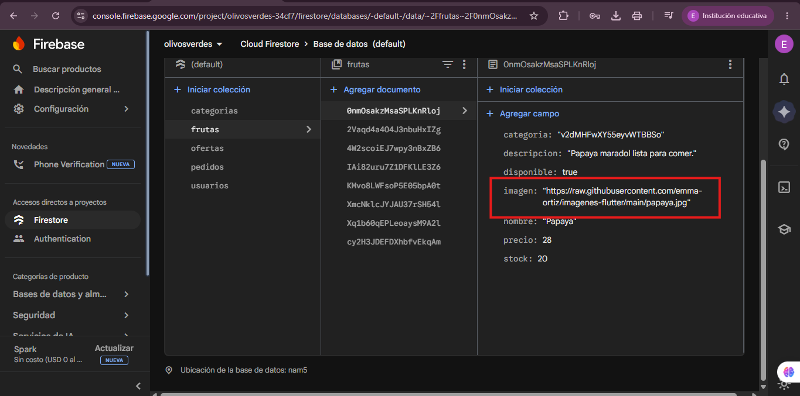

<div align="center">
  <h1>🫒 Olivos Verdes 🫒</h1>
  <p><strong>Frutería Online — E-commerce Flutter</strong></p>

  <p>
    
    
    
    
  </p>
</div>

---

## ✨ Funcionalidades

- **Autenticación** — Registro, inicio de sesión, recuperación de contraseña y modo invitado.
- **Catálogo de productos** — Explora frutas por categorías, productos destacados y ofertas activas.
- **Carrito de compras** — Agrega productos, ajusta cantidades y calcula el total.
- **Órdenes y seguimiento** — Realiza pedidos y consulta el historial con estado (pendiente, preparando, en camino, entregado).
- **Perfil de usuario** — Edita tu información personal y revisa tu historial de pedidos.
- **Panel de administración** — Los administradores pueden gestionar productos, categorías, ofertas y estados de pedidos.
- **Modo invitado** — Explora el menú sin necesidad de iniciar sesión.

## 🛠️ Tecnologías

| | |
|---|---|
| **Framework** | Flutter — Material Design |
| **Backend** | Firebase Auth, Firestore y Storage |
| **Estado** | Provider + ChangeNotifier |
| **Navegación** | GoRouter con protección de rutas |
| **Imágenes** | CachedNetworkImage, ImagePicker |

## 🚀 Cómo empezar

```bash
# Instalar dependencias
flutter pub get

# Ejecutar en dispositivo/emulador
flutter run

# Análisis estático
flutter analyze
```

> **Nota:** Necesitas un proyecto de Firebase configurado con los archivos `google-services.json` (Android) y `GoogleService-Info.plist` (iOS). Este proyecto usa el ID de Firebase `olivosverdes-34cf7`.

## 🔐 Acceso de administrador

| Campo | Valor |
|---|---|
| **Correo** | (olivos@gmail.com) |
| **Contraseña** | (olivos123) |

> El primer usuario registrado se promueve automáticamente a administrador.

## 📸 Capturas de pantalla

<div align="center">
  
  
  
  
  
  
  
  
  
  
  
  
  
  
  
  
  
  
  
  
  
  
  
  
</div>

---

<div align="center">
  <h3>Desarrollado usando Flutter, Firebase, Provider y GoRouter</h3>
</div>
